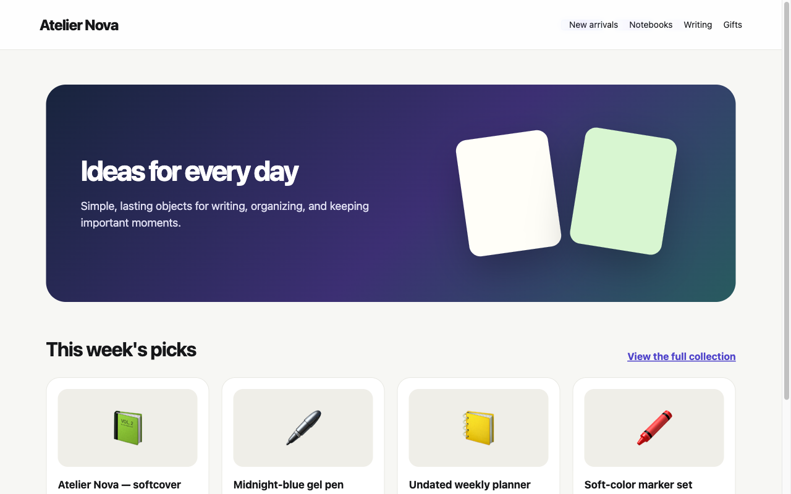
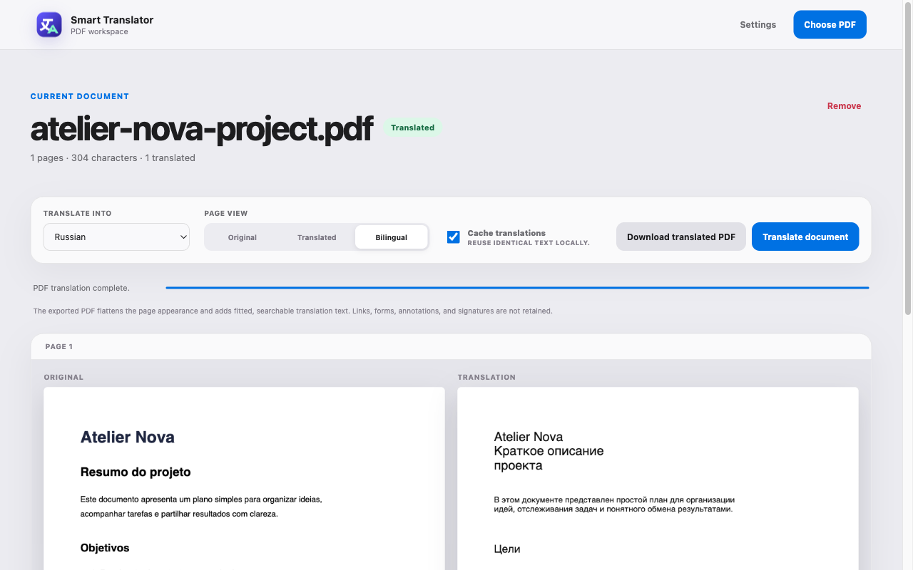
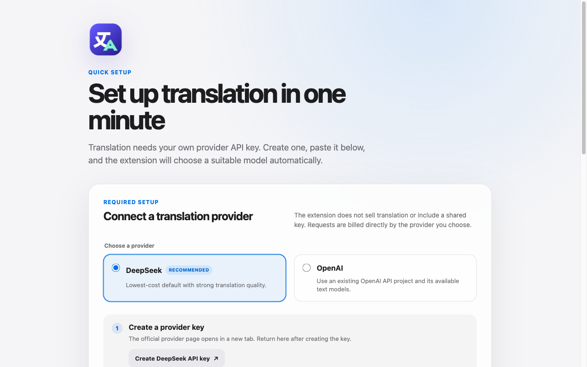

<div align="center">
  
  <h1>Smart Page Translator</h1>
  <p><strong>Complete AI translation for web pages and PDFs.</strong></p>
  <p>Read in translation or bilingual mode, keep dynamic content in sync, and reuse results from a private local cache.</p>
  <p>
    <a href="https://addons.mozilla.org/addon/smart-page-translator/"></a>
    <a href="https://chromewebstore.google.com/detail/jffbhjmhedkehlopdjepemhmladfeghp"></a>
  </p>
  <p>
    <a href="https://github.com/4erdenko/smart-page-translator/actions/workflows/ci.yml"></a>
    
    
    <a href="LICENSE"></a>
  </p>
</div>


Smart Page Translator is an open-source Manifest V3 extension for Firefox and Chrome. It translates complete websites, dynamic interfaces, selected text, editable fields, and text-based PDFs through a provider selected by the user. The extension has no ads, analytics, telemetry, shared API key, or subscription.

<table>
  <tr>
    <td width="33%"><strong>Whole-page coverage</strong><br>Translate dynamic text, product descriptions, controls, labels, and accessibility text.</td>
    <td width="33%"><strong>Three reading views</strong><br>Switch between the original, translation, and compact bilingual text without another API request.</td>
    <td width="33%"><strong>Bring your own provider</strong><br>Use DeepSeek or OpenAI with a key that stays in extension-local storage.</td>
  </tr>
</table>

## Preview

<table>
  <tr>
    <td width="50%" align="center"><br><strong>Whole-page translation</strong></td>
    <td width="50%" align="center"><br><strong>Bilingual reading</strong></td>
  </tr>
  <tr>
    <td width="50%" align="center"><br><strong>PDF workspace</strong></td>
    <td width="50%" align="center"><br><strong>Fast first-run setup</strong></td>
  </tr>
</table>

## Features

- Translates text nodes, product names, placeholders, image labels, tooltips, accessibility labels, options, and dynamically inserted DOM content.
- Preserves detected brands, trademarks, model identifiers, and proper names while translating descriptive product text.
- Lets users add exact protected names and terms that must remain unchanged.
- Translates selected text through one native browser context-menu command without modifying the page.
- Switches pages between original, translated, and compact bilingual text without another provider request.
- Sets translation-only or bilingual text as the global default, with optional per-site overrides.
- Translates a focused text field, or selected rich-editor text, through the same native context-menu command or a keyboard shortcut.
- Offers an optional compact button beside selected text. The button is disabled by default and stays hidden on never-translate websites.
- Extracts and translates visual text blocks from a local PDF, previews original and translated pages side by side, and downloads a translated copy whose only searchable text layer is the translation.
- Supports DeepSeek and OpenAI. First-run setup links directly to each provider's official key page, verifies the key before storing it locally, and selects a compatible model automatically; `.env` files and build-time keys are not used.
- Loads the models available to the configured provider account from its `/models` endpoint and filters out audio, image, embedding, moderation, realtime, and other incompatible models.
- Applies automatic language rules and per-origin `Always`, `Automatic`, or `Never` policies, including SPA route changes.
- Translates same-origin frames with the parent website while requiring an explicit `Always` rule for cross-origin frames.
- Reuses translations from a persistent, LRU-style local cache.
- Keeps private/incognito page text out of persistent storage and offers one-time translation for those tabs.
- Localizes the extension UI in English and Russian through standard WebExtension locale resources.

## Browser support

- Firefox 142 or later.
- Chrome 102 or later.
- Brave and Vivaldi can install the Chrome Web Store release.

## Install

Install the signed release from the official browser store:

- [Firefox Add-ons](https://addons.mozilla.org/addon/smart-page-translator/)
- [Chrome Web Store](https://chromewebstore.google.com/detail/jffbhjmhedkehlopdjepemhmladfeghp)

The first installation opens a focused setup page. Select DeepSeek or OpenAI, create a provider key through the linked official page, paste the key, and choose the target language. The extension verifies the connection before it stores the key locally.

## Install for development

```bash
npm ci
npm run check
```

Firefox:

1. Run `npm run build:firefox`.
2. Open `about:debugging#/runtime/this-firefox`.
3. Choose **Load Temporary Add-on** and select `dist/firefox/manifest.json`.

Chrome:

1. Run `npm run build:chrome`.
2. Open `chrome://extensions`, enable Developer mode, and choose **Load unpacked**.
3. Select `dist/chrome/`.

The first-run page selects a compatible provider model automatically. The same provider, key, and model controls remain available in Settings. Temporary Firefox add-ons are removed when Firefox exits; use the signed store release for dependable persistence across browser restarts.

Default shortcuts are:

- `Alt+Shift+P` — toggle original and translated page text.
- `Alt+Shift+U` — cycle original, translated, and bilingual page views.
- `Alt+Shift+T` — explicitly translate the focused text field or selected rich-editor text.

Browsers may reserve or remap a shortcut. Firefox exposes shortcut editing at `about:addons` under **Manage Extension Shortcuts**; Chrome exposes it at `chrome://extensions/shortcuts`.

Settings can hide the native context-menu command or enable the optional selection button. The native command handles selected page text and editable fields without adding controls to the website.

Open the PDF workspace from the extension popup. PDF bytes and filenames remain in the browser: bundled PDF.js code extracts positioned text locally, and only grouped text blocks are sent after the user presses **Translate document**. The workspace renders the original page, fits each returned translation into its detected region, and can download a new PDF that keeps the page appearance and page sizes. The visual page is flattened locally after the detected source text is masked, then the translated text is added with subsetted embedded fonts. Search, selection, and copying therefore expose the translation without a hidden duplicate source-text layer.

The export is layout-aware, not a document-reconstruction engine. Review scans, rotated or decorative text, dense forms, and text drawn inside complex artwork before using the result. Text embedded only in images is not translated. Exporting changes the PDF, flattens page interactivity, and therefore does not retain links, annotations, interactive form behavior, or digital signatures. Flattened page data is bounded to 128 MiB per exported document; larger documents must be split before export.

## Development commands

- `npm test` — run unit and race-condition tests.
- `npm run lint` — lint source, scripts, and tests with ESLint.
- `npm run build` — create both `dist/firefox/` and `dist/chrome/`.
- `npm run check` — run the complete CI-equivalent validation, including Mozilla's add-on linter.
- `npm run package:firefox` / `npm run package:chrome` — create reproducible ZIP files in `artifacts/`.
- `npm run package:source` — create a deterministic review-source ZIP from tracked Git files.
- `npm run package:stores` — create both browser packages, the Mozilla source package, and SHA-256 checksums after one full validation.

The shared manifest lives in `manifests/base.json`; browser-specific background declarations live in `manifests/firefox.json` and `manifests/chrome.json`. Firefox uses background scripts, while Chrome uses `src/service-worker.js`. Mozilla's `webextension-polyfill` keeps the Promise-based `browser.*` API consistent.

`src/assets/icon.svg` is the editable icon source. Manifest and toolbar icons use committed PNG variants from 16 to 128 pixels because Chrome does not support SVG extension icons.

## Permissions

- `activeTab` lets the popup identify and message the page on which the user opened it.
- `contextMenus` adds one configurable native command for selected text and editable fields.
- `storage` stores provider keys, settings, website rules, and cached translations locally.
- `unlimitedStorage` prevents the bounded 16 MiB cache from colliding with Chrome's smaller default local-storage quota.
- The content script matches all websites because translating arbitrary pages is the extension's single purpose.
- Host permissions are limited to `api.deepseek.com` and `api.openai.com`, the two selectable translation providers.

The extension does not request browsing history, cookies, downloads, clipboard, web request, or native messaging access.

## Cache and performance

The default cache holds 16,000 phrases, roughly 128,000 source words at eight words per phrase. The safe configurable maximum is 20,000 phrases, or roughly 160,000 source words, but the independent 16 MiB serialized-size limit is authoritative. Existing installations still set to the former 8,000-entry default migrate to 16,000; other configured limits are preserved. The `unlimitedStorage` permission prevents the cache from colliding with Chrome's normal 10 MiB `storage.local` quota; the extension still enforces its own tighter limit.

DOM references are weak, scan and cleanup work is time-sliced, request queues are bounded, and at most 12 text-bound magic rectangles can exist globally. Visible text owns both translation lanes; offscreen text uses at most one idle-scheduled lane so background translation does not compete with newly visible content. A real cache miss starts the shimmer before the provider request and keeps it perceptible even for a fast response. Translation motion uses compositor-friendly transforms and opacity, so it follows the display refresh rate, including 120 Hz displays, without a JavaScript frame loop. Cache writes are serialized and completed before a Manifest V3 background worker may suspend. Chrome storage access is restricted to trusted extension contexts. Firefox does not expose the equivalent access-level control, so bundled content scripts never read provider credentials and receive only sanitized settings through validated extension messages.

Background validation limits each translation batch to 48 items and 10,000 input characters. The extension does not impose a per-minute request or character quota by default; provider account limits remain authoritative. Concurrency, queue length, network retries, and recursive response splitting stay bounded to prevent runaway work and memory growth without stopping an ordinary large page. A short provider-outage circuit opens only after three completed transient failures and resets after 30 seconds or the next successful response; it is not a usage-rate quota.

Cache phrases are stored as independent extension-storage entries with a compact persisted index. A cold lookup reads the index and only the calculated phrase keys needed by the current batch instead of rebuilding the full cache. The 16 MiB limit includes physical storage keys and index metadata. A completed translation batch writes only its changed phrases and a small recovery marker; the full index is flushed once after the write burst. If that flush is interrupted, the marker triggers a safe index rebuild on the next start. Existing monolithic or unindexed cache data is migrated automatically on first use.

## Privacy and provider APIs

When translation is active, non-editable page text is sent directly to the selected provider. Selected text and editable-field text are sent only after an explicit user action; editable-field translations always bypass the persistent cache. PDF bytes and filenames remain local, while grouped PDF text is sent only after **Translate document** is pressed and is cached only when the workspace checkbox is enabled. Preview rendering and translated-PDF generation happen locally. Keys are never returned to content scripts or displayed after saving, but browser extension storage is not a hardware-backed secret vault; use restricted, low-limit provider keys. Private/incognito translations bypass the persistent cache, and website rules cannot be saved from a private tab.

See [PRIVACY.md](PRIVACY.md) for the complete data-flow summary and [SECURITY.md](SECURITY.md) for secret-handling guidance.

Before publishing a release, follow [docs/STORE_SUBMISSION.md](docs/STORE_SUBMISSION.md) and use the localized metadata in [docs/store/](docs/store/). Shipped third-party code is listed in [THIRD_PARTY_NOTICES.md](THIRD_PARTY_NOTICES.md).

For a Mozilla source review, use Node.js 24 and npm 11, run `npm ci`, then run `npm run build:firefox`. The generated `dist/firefox/` directory is the unpacked equivalent of the Firefox release ZIP. `npm run package:source` creates the corresponding source submission from tracked files and fails if non-ignored files remain untracked.

## Support and security

Use [GitHub Issues](https://github.com/4erdenko/smart-page-translator/issues) for reproducible, sanitized problems. Never include API keys, private URLs, account details, or captured page content. Report vulnerabilities through GitHub private vulnerability reporting as described in [SECURITY.md](SECURITY.md).

## License

Smart Page Translator is available under the [Mozilla Public License 2.0](LICENSE). Third-party components remain under their respective licenses.

Implementation references: [Firefox WebExtensions compatibility](https://developer.mozilla.org/en-US/docs/Mozilla/Add-ons/WebExtensions/Chrome_incompatibilities), [Firefox add-on policies](https://extensionworkshop.com/documentation/publish/add-on-policies/), [Chrome extension service workers](https://developer.chrome.com/docs/extensions/develop/concepts/service-workers/basics), [Chrome Web Store policies](https://developer.chrome.com/docs/webstore/program-policies/policies), [DeepSeek models API](https://api-docs.deepseek.com/api/list-models), and [OpenAI models](https://developers.openai.com/api/docs/models).
